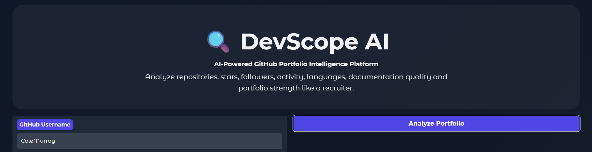
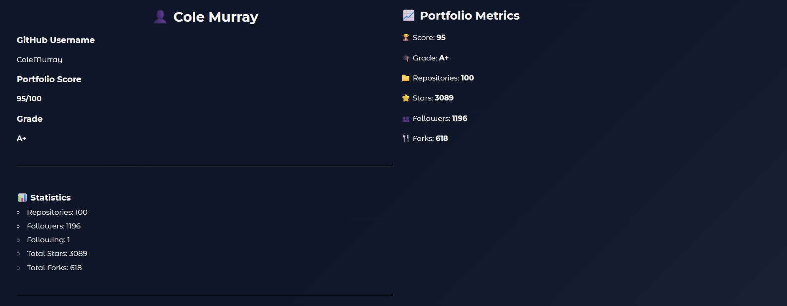
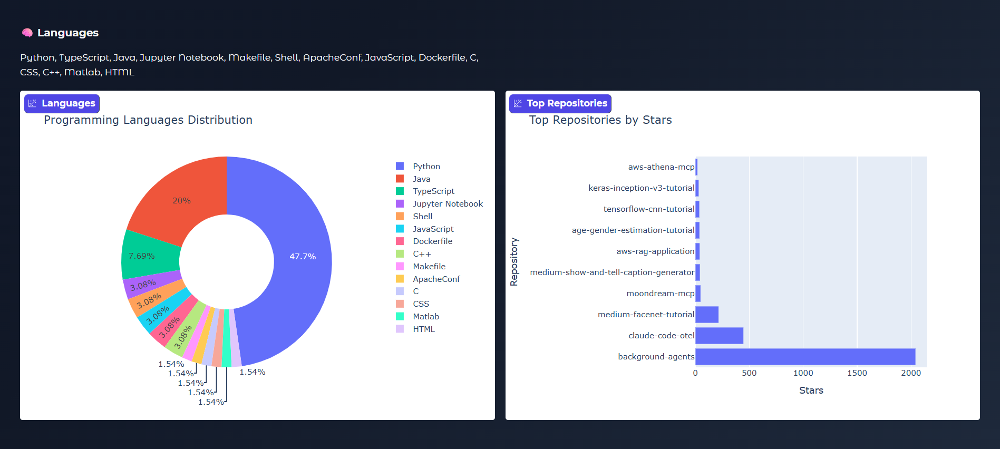

# 🎯 DevScope AI

AI-Powered GitHub Portfolio Intelligence Platform

Analyze GitHub profiles like a recruiter and generate portfolio insights, grades, and analytics dashboards.

---

## Features

✅ GitHub Profile Analysis

✅ Repository Analytics

✅ Portfolio Scoring System

✅ Recruiter-Style Grades (A+, A, B, C...)

✅ Language Distribution Analysis

✅ Top Repositories by Stars

✅ Followers & Activity Tracking

✅ Documentation Quality Assessment

✅ Project Diversity Evaluation

✅ Interactive Plotly Charts

✅ Modern Gradio Dashboard

---

## Screenshots

### Dashboard



### Portfolio Analysis



### Analytics Charts



---

## Tech Stack

- Python
- Gradio
- Plotly
- Pandas
- Requests
- GitHub REST API

---

## How It Works

1. Enter a GitHub username
2. Fetch profile and repository data
3. Analyze portfolio quality
4. Generate recruiter-style score
5. Display insights and analytics

---

## Scoring Factors

- Repository Count
- GitHub Stars
- Followers
- Technology Diversity
- Documentation Quality
- README Presence
- Project Diversity
- Recent Activity

---

## Installation

```bash
pip install gradio requests pandas plotly
```

Run:

```bash
python app.py
```

---

## Example Analysis

Portfolio Score: 95/100

Grade: A+

Metrics:

- Repositories
- Followers
- Stars
- Forks
- Languages

---

## Future Improvements

- AI Career Recommendations
- Resume Analysis
- GitHub README Quality Analysis
- Contribution Graph Analysis
- Team Collaboration Scoring

---

## 👨‍💻 Author

**Areef Rasool**

BSAI Student | AI, Computer Vision & Networking Enthusiast


Built with Python, Gradio and GitHub API.
